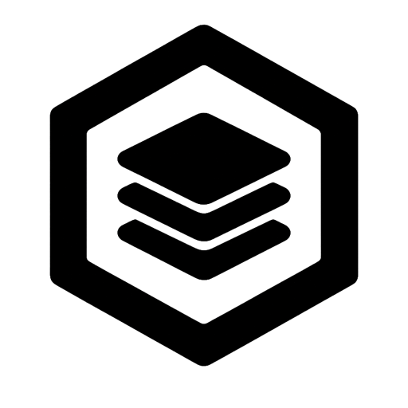

<p align="center">
  
</p>

<h1 align="center">OpenPlanTier</h1>

<p align="center">
  Discover, compare, and combine open-source building blocks for a Palantir-like operating platform.
</p>

<p align="center">
  
  
  
  
  
</p>

## Quick start

Requires Node.js 22.13 or newer.

```bash
git clone https://github.com/leejaywon/OpenPlanTier.git
cd OpenPlanTier
npm install
npm run dev
```

Open [http://localhost:3000](http://localhost:3000).

## What it does

- Search and filter curated open-source projects by capability and license.
- Build a stack from individual projects or reference recipes.
- Export a manifest or a source-download script.

## License

No license is currently declared for OpenPlanTier. Catalog entries retain their own licenses.

OpenPlanTier is independent and is not affiliated with Palantir Technologies.
